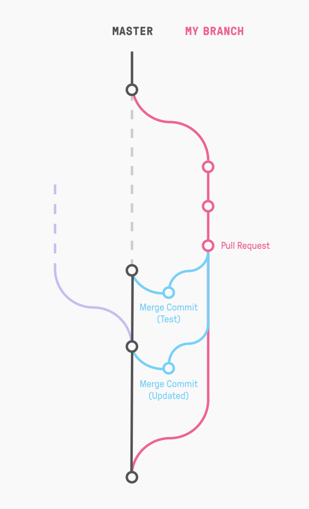

# fusionner


[Documentation](https://lawliet89.github.io/fusionner/)

`fusionner` is French for merge. This tool exists to create merge commits between your watched topic branches
and your target default branch.

These merged commits can then be tested in your CI tool.

Consider the diagram below:


Normally, tests will be run on the commit labelled `Pull Request`. Ideally, we would like to run tests
on a merge commit with your `master` branch. This is what `fusionner` does!

If your `master` branch has moved on, `fusionner` will update the merge commit with the new commits from `master`.

## Linting
Code should be formatted with [`rustfmt`](https://github.com/rust-lang-nursery/rustfmt):
` cargo fmt -- --write-mode=overwrite`

## Test
Tests can simply be run with `cargo test`.

## Usage
fusionner can be included as a crate (i.e. library) in your code, or run directly as an executable.

For usage as an executable, you can see the usage documentation with `cargo run -- --help`.

For usage as a library, please look at [`src/main.rs`](src/main.rs) as an example for now, until the documentation
is written.

```toml
[dependencies]
fusionner = { git = "https://github.com/lawliet89/fusionner", branch = "master" }
```
